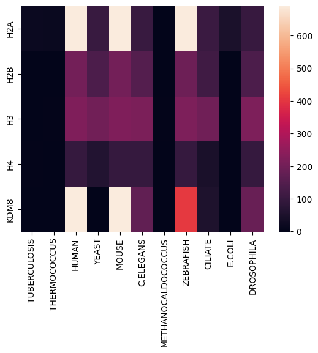

# Майнор "Биоинформатика". Проект. Индивидуальная часть

Гистоновая метка: H3K36me

Выбранный белок: KDM8

## Описание белка

Функция: Histone modification erase.

Регулирует H3K36me2 и необходим для поздних стадий гомологичной рекомбинации и целостности генома. Потеря KDM8 приводит к гиперчувствительности к ионизирующему излучению и к мейотическим дефектам. Действует в области, кодирующей циклин A1, регулируя пролиферацию раковых клеток.

### Статьи

JMJD-5/KDM8 regulates H3K36me2 and is required for late steps of homologous recombination and genome integrity (https://pubmed.ncbi.nlm.nih.gov/28207814/)

KDM8, a H3K36me2 histone demethylase that acts in the cyclin A1 coding region to regulate cancer cell proliferation (https://www.researchgate.net/publication/44587730_KDM8_a_H3K36me2_histone_demethylase_that_acts_in_the_cyclin_A1_coding_region_to_regulate_cancer_cell_proliferation)

### Экспрессия

### Домены

## Выравнивание гистонов

Выравнивание было произведено при помощи программы MEGAX.

### H2A

Есть две группы последовательностей, похожих между собой: c 1 по 13 и с 23 по 40. Можно считать, что они кодируют один и тот же ген. Остальные последовательности отличаются, но, возможно, они выполняют такие же функции или схожи по пространственному строению.

### H2B

Большая часть последовательностей похожа между собой. Можно считать, что они кодируют один и тот же ген. Отличающиеся последовательности, возможно, выполняют такие же функции или схожи по пространственному строению.

### H3

Все последовательности похожи между собой, поэтому можно считать, что они кодируют один и тот же ген.

### H4

Все последовательности похожи между собой, поэтому можно считать, что они кодируют один и тот же ген.

## E-value

|      | TUBERCULOSIS | THERMOCOCCUS |         HUMAN |        YEAST |         MOUSE |    C.ELEGANS | METHANOCALDOCOCCUS |     ZEBRAFISH |      CILIATE |       E.COLI |   DROSOPHILA |
|-----:|-------------:|-------------:|--------------:|-------------:|--------------:|-------------:|-------------------:|--------------:|-------------:|-------------:|-------------:|
|  H2A | 5.290000e-09 | 1.710000e-07 | 1.000000e-300 | 1.070000e-45 | 1.000000e-300 | 2.710000e-45 |              1.200 | 1.000000e-300 | 3.440000e-46 | 1.180000e-21 | 1.230000e-43 |
|  H2B | 2.300000e+00 | 1.200000e+00 |  2.780000e-88 | 1.010000e-60 |  1.950000e-88 | 5.980000e-66 |              1.700 |  1.860000e-83 | 4.620000e-51 | 1.600000e+00 | 2.750000e-60 |
|  H3  | 4.600000e+00 | 5.700000e-02 |  2.190000e-96 | 3.310000e-87 |  1.540000e-96 | 4.460000e-94 |              0.034 |  1.770000e-95 | 8.410000e-86 | 1.000000e+00 | 9.390000e-96 |
|  H4  | 3.200000e-02 | 6.200000e-01 |  2.290000e-42 | 4.060000e-28 |  1.600000e-42 | 4.010000e-43 |              0.620 |  4.510000e-43 | 2.780000e-20 | 1.000000e+00 | 1.290000e-42 |
| KDM8 | 3.300000e+00 | 2.200000e+00 | 1.000000e-300 | 1.000000e+00 | 1.000000e-300 | 2.200000e-76 |              0.990 | 1.770000e-176 | 1.280000e-23 | 1.000000e+00 | 1.910000e-80 |

## Тепловая карта

