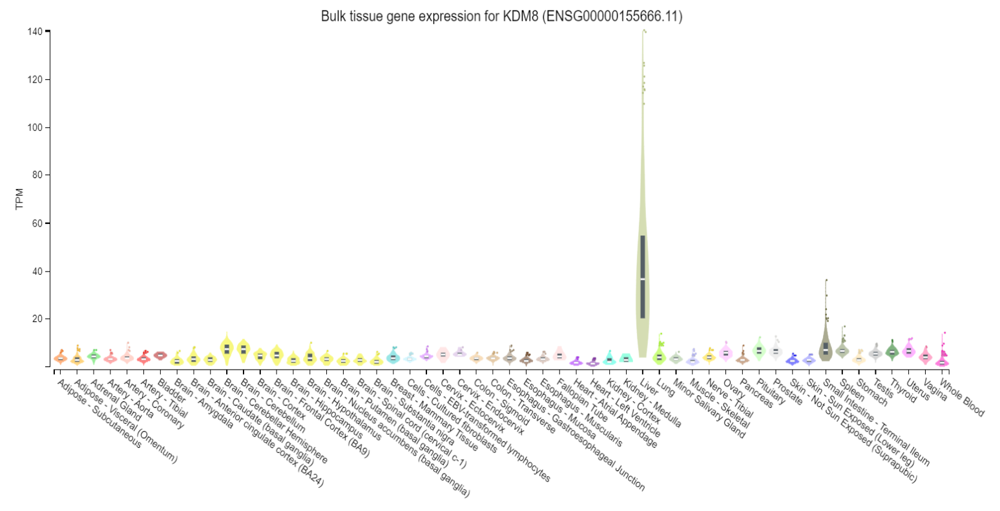
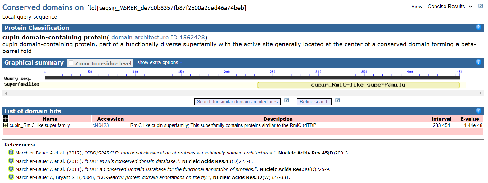
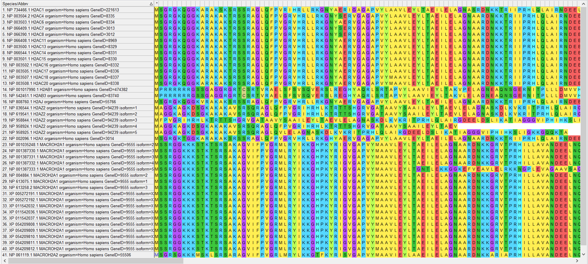
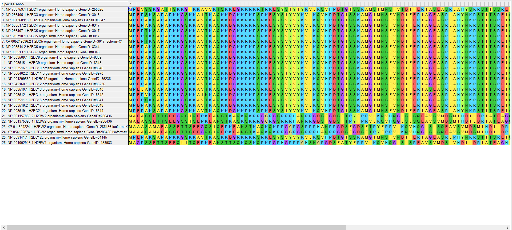
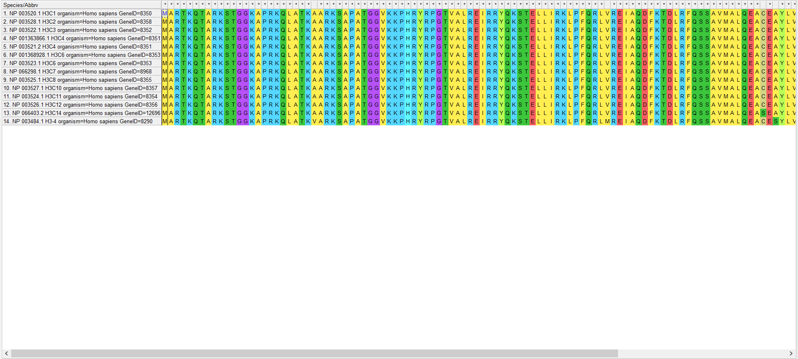
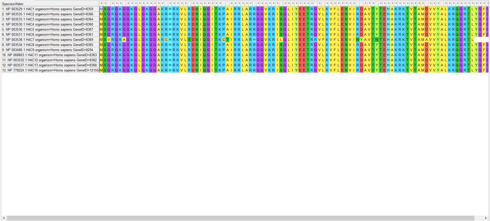
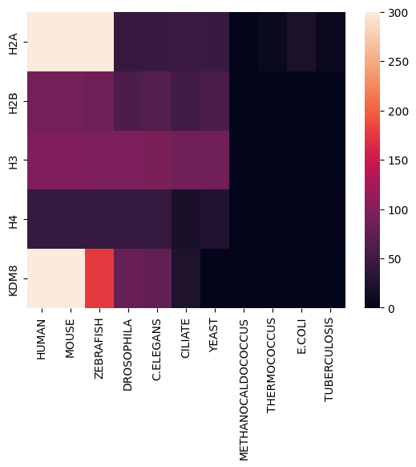

# Майнор "Биоинформатика". Проект. Индивидуальная часть

Гистоновая метка: H3K36me

Выбранный белок: KDM8

## Описание белка

Функция: Histone modification erase.

Регулирует H3K36me2 и необходим для поздних стадий гомологичной рекомбинации и целостности генома. Потеря KDM8 приводит к гиперчувствительности к ионизирующему излучению и к мейотическим дефектам. Действует в области, кодирующей циклин A1, регулируя пролиферацию раковых клеток.

### Статьи

JMJD-5/KDM8 regulates H3K36me2 and is required for late steps of homologous recombination and genome integrity (https://pubmed.ncbi.nlm.nih.gov/28207814/)

KDM8, a H3K36me2 histone demethylase that acts in the cyclin A1 coding region to regulate cancer cell proliferation (https://www.researchgate.net/publication/44587730_KDM8_a_H3K36me2_histone_demethylase_that_acts_in_the_cyclin_A1_coding_region_to_regulate_cancer_cell_proliferation)

### Экспрессия

### Домены

## Выравнивание гистонов

Выравнивание было произведено при помощи программы MEGAX.

### H2A

Есть две группы последовательностей, похожих между собой: c 1 по 13 и с 23 по 40. Можно считать, что они кодируют один и тот же ген. Остальные последовательности отличаются, но, возможно, они выполняют такие же функции или схожи по пространственному строению.

### H2B

Большая часть последовательностей похожа между собой. Можно считать, что они кодируют один и тот же ген. Отличающиеся последовательности, возможно, выполняют такие же функции или схожи по пространственному строению.

### H3

Все последовательности похожи между собой, поэтому можно считать, что они кодируют один и тот же ген.

### H4

Все последовательности похожи между собой, поэтому можно считать, что они кодируют один и тот же ген.

## Поиск по протеомам

Выбранные последовательности для каждого гистона находятся в соотвествующих файлах.

Ноутбук: https://colab.research.google.com/drive/1WISS6PV_reE6yByARt0wuQfRYGhn-76L?usp=sharing

## E-value

|      |         HUMAN |         MOUSE |     ZEBRAFISH |   DROSOPHILA |    C.ELEGANS |      CILIATE |        YEAST | METHANOCALDOCOCCUS | THERMOCOCCUS |       E.COLI | TUBERCULOSIS |
|-----:|--------------:|--------------:|--------------:|-------------:|-------------:|-------------:|-------------:|-------------------:|-------------:|-------------:|-------------:|
|  H2A | 1.000000e-300 | 1.000000e-300 | 1.000000e-300 | 1.230000e-43 | 2.710000e-45 | 3.440000e-46 | 1.070000e-45 |              1.200 | 1.710000e-07 | 1.180000e-21 | 5.290000e-09 |
|  H2B |  2.780000e-88 |  1.950000e-88 |  1.860000e-83 | 2.750000e-60 | 5.980000e-66 | 4.620000e-51 | 1.010000e-60 |              1.700 | 1.200000e+00 | 1.600000e+00 | 2.300000e+00 |
|  H3  |  2.190000e-96 |  1.540000e-96 |  1.770000e-95 | 9.390000e-96 | 4.460000e-94 | 8.410000e-86 | 3.310000e-87 |              0.034 | 5.700000e-02 | 1.000000e+00 | 4.600000e+00 |
|  H4  |  2.290000e-42 |  1.600000e-42 |  4.510000e-43 | 1.290000e-42 | 4.010000e-43 | 2.780000e-20 | 4.060000e-28 |              0.620 | 6.200000e-01 | 1.000000e+00 | 3.200000e-02 |
| KDM8 | 1.000000e-300 | 1.000000e-300 | 1.770000e-176 | 1.910000e-80 | 2.200000e-76 | 1.280000e-23 | 1.000000e+00 |              0.990 | 2.200000e+00 | 1.000000e+00 | 3.300000e+00 |

### $-\log_{10}$(E-value)

|      |      HUMAN |      MOUSE |  ZEBRAFISH | DROSOPHILA | C.ELEGANS |   CILIATE |     YEAST | METHANOCALDOCOCCUS | THERMOCOCCUS |    E.COLI | TUBERCULOSIS |
|-----:|-----------:|-----------:|-----------:|-----------:|----------:|----------:|----------:|-------------------:|-------------:|----------:|-------------:|
|  H2A | 300.000000 | 300.000000 | 300.000000 |  42.910095 | 44.567031 | 45.463442 | 44.970616 |          -0.079181 |     6.767004 | 20.928118 |     8.276544 |
|  H2B |  87.555955 |  87.709965 |  82.730487 |  59.560667 | 65.223299 | 50.335358 | 59.995679 |          -0.230449 |    -0.079181 | -0.204120 |    -0.361728 |
|  H3  |  95.659556 |  95.812479 |  94.752027 |  95.027334 | 93.350665 | 85.075204 | 86.480172 |           1.468521 |     1.244125 | -0.000000 |    -0.662758 |
|  H4  |  41.640165 |  41.795880 |  42.345823 |  41.889410 | 42.396856 | 19.555955 | 27.391474 |           0.207608 |     0.207608 | -0.000000 |     1.494850 |
| KDM8 | 300.000000 | 300.000000 | 175.752027 |  79.718967 | 75.657577 | 22.892790 | -0.000000 |           0.004365 |    -0.342423 | -0.000000 |    -0.518514 |

## Тепловая карта

## Вывод

По таблицам и тепловой карте можно сделать вывод, что исследуемые белки появились у одноклеточных эукариот и далее перешли к многоклеточным беспозвоночным и позвоночным. У архей и бактерий данные белки почти не прослеживаются.
